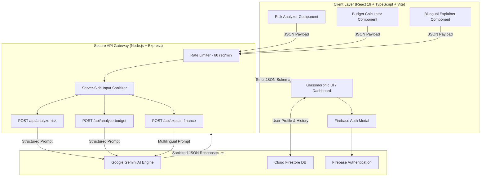

<div align="center">

# 🛡️ FinShield — AI-Powered Financial Protection & Intelligence Engine

### *Guarding Digital Wealth with Real-Time Scam Detection, Smart Budgeting & Multilingual Financial Literacy*

[](https://ai.studio)
[](https://ai.google.dev)
[](https://react.dev)
[](https://www.typescriptlang.org/)
[](https://firebase.google.com/)
[](https://tailwindcss.com/)
[](LICENSE)

</div>

---

## 🚀 Executive Summary

Financial scams, phishing attacks, and complex financial jargon rob individuals of billions annually. **FinShield** is an all-in-one AI security and financial wellness platform built for modern digital users. Powered by **Google Gemini AI** and **Firebase**, FinShield delivers real-time scam threat analysis, intelligent budget coaching, and bilingual financial literacy education within a sleek, glassmorphic dashboard.

---

## ✨ Key Features & Capability Matrix

| Module | Core Capability | Tech Details / AI Model |
| :--- | :--- | :--- |
| 🛡️ **Scam & Risk Analyzer** | Real-time threat detection for SMS, emails, investment schemes, & payment links | Gemini 2.5 + Server Prompt Injection Defense |
| 📊 **Smart Budget Coach** | 50/30/20 rule calculator, expense breakdown, & automated financial advice | Gemini 2.5 + Recharts Financial Visualizations |
| 💡 **Bilingual Explainer** | Simplifies complex financial terms (SIPs, FDs, Mutual Funds, Taxes) in **English & Hindi** | Gemini 2.5 + Multilingual Financial Prompting |
| 🔐 **Firebase Auth & Data** | Secure user authentication (Email/Pass & Google) with cloud persistence | Firebase Auth + Cloud Firestore |
| ⚡ **Hardened API Gateway** | Server-side API key boundary, rate-limiting, and payload sanitization | Express.js + TSX + Custom Rate Limiter |

---

## 🏗️ System Architecture

FinShield utilizes a **Zero-Trust Client/Server Architecture**. The client web app never directly communicates with external AI endpoints, ensuring complete API key privacy and input sanitization before prompts reach Google Gemini.

### High-Level Architecture Diagram (Mermaid)



### Detailed AI Risk Processing Pipeline

```
┌─────────────────┐       ┌──────────────────────┐       ┌───────────────────────┐
│ User Input      │ ───►  │ Server-Side Rules    │ ───►  │ Gemini AI Risk Engine │
│ (Suspicious     │       │ • Length Validation  │       │ • Red Flag Extraction │
│  Text / Link)   │       │ • Injection Filtering│       │ • Threat Scoring      │
└─────────────────┘       └──────────────────────┘       └───────────┬───────────┘
                                                                     │
┌─────────────────┐       ┌──────────────────────┐                   │
│ Actionable      │ ◄───  │ Structured Response  │ ◄─────────────────┘
│ Recommendation  │       │ • Score: 0-100       │
│ & Risk Badge    │       │ • Level: CRITICAL/HIGH│
└─────────────────┘       └──────────────────────┘
```

---

## 🛠️ Technology Stack

| Layer | Technology | Usage |
| :--- | :--- | :--- |
| **Frontend Framework** | React 19 + Vite 6 | Lightning-fast rendering & Hot Module Replacement |
| **Styling & Animations**| Tailwind CSS v4 + Framer Motion | Modern dark mode, glassmorphic UI & micro-interactions |
| **Icons & Charts** | Lucide React + Recharts | High-density data visualization & intuitive icons |
| **Backend Server** | Node.js + Express + TSX | Secure API routing & middleware pipeline |
| **Artificial Intelligence**| Google GenAI SDK (`@google/genai`) | Gemini models for threat analysis & financial logic |
| **Auth & Database** | Firebase SDK v12 | Authentication & Cloud Firestore state persistence |
| **Bundling & Production** | Esbuild + Vite | Optimized server and client production artifacts |

---

## 🎯 Detailed Feature Breakdown

### 1. 🛡️ AI Risk & Scam Detection Engine (Hero Feature)
- **Problem**: Millions fall prey to phishing messages, fake OTP calls, and ponzi investment schemes.
- **Solution**: FinShield evaluates any text or message snippet against known scam indicators.
- **Output**:
  - **Risk Score**: 0 to 100
  - **Severity Level**: `LOW`, `MEDIUM`, `HIGH`, `CRITICAL`
  - **Red Flags**: Itemized bullet points of suspicious tactics (e.g., urgency, unverified links, impersonation).
  - **Actionable Steps**: Concrete safety instructions (e.g., "Do not click link", "Report to National Cyber Crime").

### 2. 📊 Smart Budget & Expense Coach
- **Financial Calculations**: Automatically computes total expenses, net savings, and savings rate percentage.
- **Rule Verification**: Compares allocations against the **50/30/20 rule** (Needs / Wants / Savings).
- **Gemini Recommendations**: Generates tailored recommendations to optimize monthly expenditure and reach savings goals faster.

### 3. 💡 Bilingual Financial Literacy Engine (English & Hindi)
- **Democratizing Knowledge**: Breaks down intimidating financial jargon into simple language.
- **Language Support**: Seamlessly toggles between **English** and **Hindi (हिन्दी)**.
- **Structured Explanations**: Provides key definition, real-world examples, pros/cons, and key takeaways.

---

## 🔒 Security & Privacy Architecture

- **Zero API Key Leakage**: The Google Gemini API key resides exclusively in server-side environment variables (`GEMINI_API_KEY`).
- **Prompt Injection Defense**: Server-side validation (`validators.ts`) sanitizes input strings to neutralize malicious prompt override attempts.
- **Rate Limiting**: Integrated in-memory rate limiter caps requests at **60 calls per minute per IP address**, preventing DDoS and API quota exhaustion.
- **Bounded Payloads**: Body parser enforced limit of **500KB**, shielding memory from buffer overflow attacks.

---

## 📡 API Documentation

### `POST /api/analyze-risk`
Analyzes a message or scheme for scam risk.

**Request Body:**
```json
{
  "message": "URGENT: Your bank account will be blocked today. Update your KYC immediately by clicking http://bit.ly/fake-bank-kyc"
}
```

**Response (200 OK):**
```json
{
  "score": 95,
  "level": "CRITICAL",
  "summary": "High-risk phishing scam impersonating a bank to steal credentials.",
  "redFlags": [
    "Urgent pressure tactics claiming account closure",
    "Unverified shortened link (bit.ly)",
    "Request for sensitive personal/KYC information"
  ],
  "safetySteps": [
    "Do NOT click on the link",
    "Never share OTPs or passwords",
    "Contact your bank directly via their official app or website"
  ],
  "category": "Phishing / Bank Impersonation"
}
```

---

### `POST /api/analyze-budget`
Evaluates financial metrics and generates AI coaching advice.

**Request Body:**
```json
{
  "monthlyIncome": 50000,
  "fixedExpenses": 20000,
  "variableExpenses": 15000,
  "savingsGoal": 15000
}
```

---

### `POST /api/explain-finance`
Provides bilingual financial explanations.

**Request Body:**
```json
{
  "question": "What is a Mutual Fund?",
  "language": "en"
}
```

---

## 💻 Quick Start & Local Setup

### Prerequisites
- Node.js (v18.x or higher)
- npm or bun
- A valid **Google Gemini API Key** ([Get key from Google AI Studio](https://aistudio.google.com/))

### 1. Clone the Repository
```bash
git clone https://github.com/NEXORA1425/FinShield.git
cd FinShield
```

### 2. Install Dependencies
```bash
npm install
```

### 3. Configure Environment Variables
Create a `.env` file in the root directory:
```env
GEMINI_API_KEY=your_google_gemini_api_key_here
PORT=3000
NODE_ENV=development
```

### 4. Run Development Server
```bash
npm run dev
```
Open your browser at `http://localhost:3000` to interact with FinShield!

### 5. Build for Production
```bash
npm run build
npm start
```

---

## 📂 Project Structure

```
FinShield/
├── .env.example                # Sample environment variables configuration
├── .gitignore                  # Git ignore rules
├── firebase.json               # Firebase hosting & hosting configuration
├── firestore.rules             # Cloud Firestore security rules
├── index.html                  # HTML5 entry template
├── package.json                # Project dependencies and npm scripts
├── server.ts                   # Express server entry point & API gateway
├── server/                     # Backend API modules
│   ├── ai/                     # Gemini AI integrations & structured output parsers
│   │   ├── budgetAnalyzer.ts   # Smart budget AI logic
│   │   ├── financialExplainer.ts # Bilingual financial literacy logic
│   │   ├── gemini.ts           # Google GenAI client initialization & JSON extractor
│   │   └── riskAnalyzer.ts     # Scam & risk detection AI logic
│   └── validation/             # Input sanitization & prompt injection defense
│       └── validators.ts       # Input schema validation
├── src/                        # Frontend React 19 application
│   ├── App.tsx                 # Main application container & view router
│   ├── components/             # Reusable UI components
│   │   ├── AuthModal.tsx       # Firebase authentication modal
│   │   ├── BudgetAnalyzer.tsx  # Budget calculator & Recharts dashboard
│   │   ├── Dashboard.tsx       # Overview dashboard with risk metrics
│   │   ├── FinancialExplainer.tsx # Multilingual literacy component
│   │   ├── Footer.tsx          # Application footer
│   │   ├── LandingPage.tsx     # Hero section & value proposition
│   │   ├── Navbar.tsx          # Header navigation bar
│   │   ├── PrivacyBanner.tsx   # Privacy disclosure banner
│   │   ├── RiskAnalyzer.tsx    # Risk analyzer interactive view
│   │   └── Sidebar.tsx         # Navigation sidebar
│   ├── context/                # React contexts
│   │   └── AuthContext.tsx     # Firebase Auth state management
│   ├── lib/                    # SDK initializations
│   │   └── firebase.ts         # Firebase App, Auth & Firestore config
│   ├── index.css               # Tailwind CSS styles & custom utility classes
│   └── types.ts                # Shared TypeScript interface definitions
└── vite.config.ts              # Vite bundle configuration
```

---

## 🏆 Hackathon Value & Impact

- **Real-World Utility**: Solves a pressing problem impacting millions daily — financial fraud and low financial literacy.
- **Responsible AI Usage**: Implements strict safety guardrails, prompt injection protection, and structured JSON parsing.
- **Inclusive Design**: Bilingual support ensures accessibility across diverse demographics.
- **Production-Ready Architecture**: Clean separation between frontend components and backend API endpoints with Firebase integration.

---

## 📄 License

Distributed under the MIT License. See `LICENSE` for more information.

---

<div align="center">
  <sub>Built with ❤️ by <b>Team NEXORA</b> for Google AI Studio Hackathon</sub>
</div>
